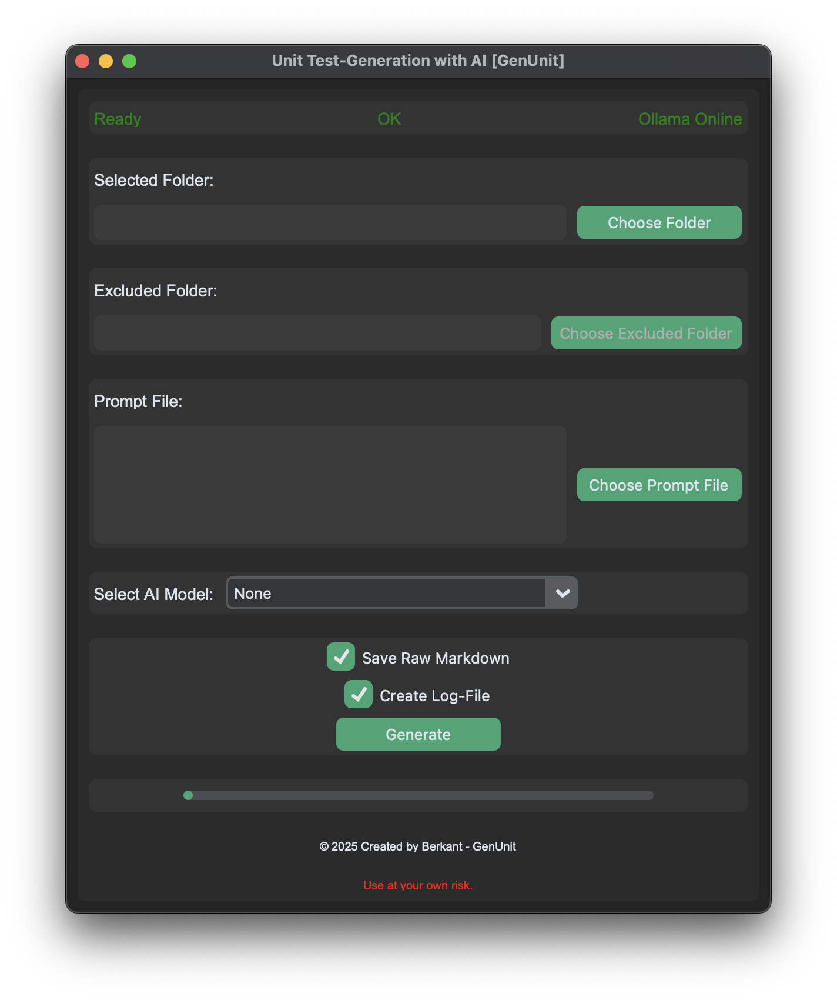

# AI-generated Unit-Test-Generation

<p>English Version</p>

📌 **[German Version](README.md)**

<hr>

## Table of contents

1. [Motivation](#1-motivation)
2. [Installation](#2-installation)
3. [How to use](#3-how-to-use)
4. [Code](#4-code)
5. [Ollama](#5-ollama)
6. [Contributors](#6-contributors)
7. [Licence](#7-licence)
8. [Version](#8-version)

<hr><hr>

## 1. Motivation

This project was developed as part of my bachelor thesis at **HFU Furtwangen**. The aim is to test different **open source AI models** to find out which model is best suited for automatic **unit test generation**.

> **Why?**  
- Software is growing rapidly, testing is time-consuming.  
- AI can speed up & automate the **testing process**.  
- Models can be specifically optimized for testing with special **prompts**.

This tool was developed with **Python & CustomTkinter** and uses **local LLMs via Ollama** to generate tests efficiently.

<hr>

## 2. Installation

### **Clone project & install dependencies:**
```bash
git clone https://github.com/beri336/KI-unterstuetzte-Unit-Test-Generierung
cd KI-unterstuetzte-Unit-Test-Generierung
pip install -r requirements.txt
```

### **Manual installation of the libraries:**
```bash
pip install customtkinter ollama psutil
```

<hr>

## 3. How to use

**GUI Preview:**


### **Step-by-step instructions**
1. **Select the project folder** -> `Choose Folder`.
2. **(Optional) Exclude a subfolder** -> Choose Excluded Folder (e.g., virtual environment).
3. **Load a prompt file** (if `prompt.{md, txt, doc}` exists in the folder, it will be loaded automatically).
    - If no prompt file is found, you can manually select one with `Choose Prompt` or type directly into the text field.
4. **Select an AI model** -> `Select AI Model`.
5. **Set options**:
    - `Save Raw Markdown`: Saves the full AI response.
    - `Create Log-File`: Creates a log file for documentation.
6. **Start the generation process** -> `Generate`.

<hr>

## 4. Code

### **Helper Functions**  
> `output_terminal(...)`
- Displays color-coded debugging messages in the terminal.

> `set_status_label(...)`
- Updates the status label.

> `set_generate_label(...)`
- Updates the generation status label.

> `set_ollama_label(...)`
- Sets the Ollama status label based on connection status.

<br>

### **Test Generation**
> `generate_tests()`
- Starts test generation & disables UI elements.

> `generate_tests_for_folder(...)`
- Creates tests for all Python files in the folder.

> `generate_test_for_file(...)`
- Generates a unit test for a single file.

> `extract_python_code(...)`
- Extracts only Python code from the AI response.

> `save_files(...)`
- Saves generated tests and optionally a Markdown file.

<br>

### **Progress & Status Updates**
> `initialize_progress_bar(...)`
- Initializes the progress bar at 0%.

> `update_progress_bar(...)`
- Updates the progress bar based on progress.

> `reset_progress_bar()`
- Resets the progress bar.

> `check_generation_completion()`
- Monitors test generation progress.

<br>

### **Model & AI Interaction**
> `fetch_models()`
- Loads available AI models using `ollama list`.

> `on_model_select(...)`
- Updates the selected AI model and UI button.

> `check_ollama_status()`
- Periodically checks if Ollama is running.

<br>

### **File & Folder Selection**
> `choose_folder()`
- Opens a dialog to select the project folder.

> `choose_exclude_folder()`
- Allows excluding a subfolder.

> `choose_prompt_file()`
- Enables manual loading of a prompt file.

<br>

### **GUI**
> `setup_gui()`
- Creates the user interface using CustomTkinter.
- Organizes the GUI into several frames for a clean structure:
  - **Frame 1**: Status displays for test and Ollama status.
  - **Frame 2**: Selection of the main folder.
  - **Frame 3**: Exclusion of a subfolder.
  - **Frame 4**: Display of the prompt file.
  - **Frame 5**: Dropdown for model selection.
  - **Frame 6**: `Generate` button.
  - **Frame 7**: Progress bar.

<hr>

## 5. Ollama
### **What is Ollama?**  
- A lightweight framework for running **Large Language Models (LLMs)** locally.  
- Supports models like **LLama 3, Phi 3, Gemma 2**.  
- **Advantages:** No cloud upload, full control, open-source.  
- [Official Website](https://ollama.com)  

### **Installation & Usage**
```bash
# Install a model
ollama pull {modellname}

# Show available models
ollama list

# Start a model
ollama run {modellname}

# Stop model
ollama stop {model name}

# Show model details
ollama show {model name}
```

### **Example:**
```bash
ollama pull llama3
ollama run llama3
```

<hr>

## 6. Contributors
- **Berkant Simsek**

<hr>

## 7. Licence
- **MIT Licence**

<hr>

## 8. Version
> V1.0 of GenUnit
- **Automated unit test creation with AI.**

<hr>